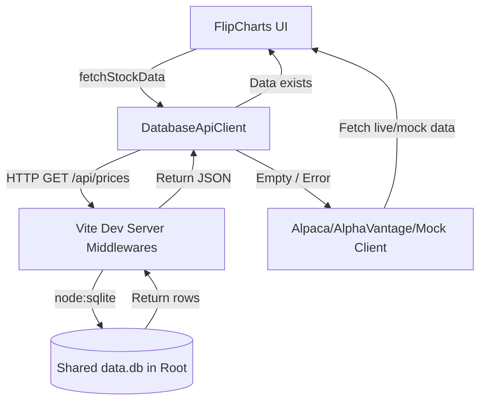

# FlipCharts

FlipCharts is a modern, responsive React + TypeScript stock momentum and candlestick charting dashboard. It displays tickers from a YAML-formatted watchlist, filters them dynamically by tags, and visualizes price trends with high-performance charts.

To optimize data usage and avoid hitting third-party rate limits, FlipCharts is integrated with a **shared SQLite database** created by the sibling `grep_alpha` project. It reads local historical daily data when available, and transparently falls back to external APIs when needed.

---

## 🚀 Key Features

* **Interactive Candlestick Charts**: Built using TradingView's lightweight and high-performance `lightweight-charts` library.
* **Tag-Based Filtering**: Dynamically parses your watchlist and groups symbols by tags for fast sidebar filtering.
* **Shared SQLite Caching**:
  * Exposes an `/api/prices` endpoint via Vite's development server.
  * Queries `data.db` at the workspace root using Node.js's built-in `node:sqlite` module.
  * Prevents duplicate external API calls for synced tickers.
* **Robust Fallback Strategy**: Falls back automatically to Alpaca Market Data V2, Alpha Vantage, or realistic mock data if the database doesn't contain the requested ticker's data or timeframe.
* **Pencil Notes/Thesis Editor**: Display and edit investment theses per ticker, saved locally.
* **Aggregate Watchlist Stats**: Provides dynamic performance indicators across your entire watchlist.

---

## 🛠️ Getting Started

### Prerequisites

Ensure you have **Node.js** (v22.5.0 or later is recommended for the built-in `node:sqlite` module).

### Installation

1. Navigate to the `FlipCharts` project directory:
   ```bash
   cd FlipCharts
   ```

2. Install dependencies:
   ```bash
   npm install
   ```

### Running Locally

To start the Vite development server:
```bash
npm run dev
```
The server will boot on `http://localhost:3000`. 

> [!NOTE]
> During development, Vite serves the SQLite query API at `/api/prices?symbol=TICKER&timeframe=TIMEFRAME`.

### Building for Production

To compile TypeScript and build the production bundle:
```bash
npm run build
```

---

## ⚙️ Configuration & Watchlist

### 1. Watchlist Definition (`watchlist.yaml`)
Define your watchlist in `watchlist.yaml` in the root of the `FlipCharts` directory. The structure uses the following YAML format:

```yaml
- symbol: RCAT
  status: watching
  target_entry: 3.50
  thesis: "Leading provider of sUAS drones for defense. Strong organic revenue growth."
  tags: sUAS_drones, tactical_imaging, defense
```

### 2. External API Fallbacks
If a ticker's data is not present in the local SQLite database, FlipCharts will request live pricing. You can configure your credentials:
* **Via Environment Variables**: Set the credentials in a `.env` or `.env.local` file:
  ```env
  VITE_ALPACA_KEY_ID=your_alpaca_key_id
  VITE_ALPACA_SECRET_KEY=your_alpaca_secret_key
  VITE_ALPHA_VANTAGE_KEY=your_alpha_vantage_key
  ```
* **Via Settings Modal**: Click the Settings gear icon in the FlipCharts web app UI to supply keys directly in your browser.

---

## 📁 Repository Structure

```
FlipCharts/
├── dist/                # Production build output
├── src/
│   ├── components/      # React layout components (ChartCard, WatchlistStats, etc.)
│   ├── context/         # ServiceContext managing API clients and watchlist state
│   └── lib/
│       ├── api/         # ApiClient, Fallback handler, and DatabaseApiClient
│       ├── charts/      # Lightweight charts adapter logic
│       ├── storage/     # LocalStorage wrappers
│       └── utils/       # YAML parser and utilities
├── package.json
├── tsconfig.json
├── vite.config.ts       # Vite config exposing Node:SQLite middleware endpoint
└── watchlist.yaml       # Tickers database config
```

---

## 🔗 How the Shared Database Works


