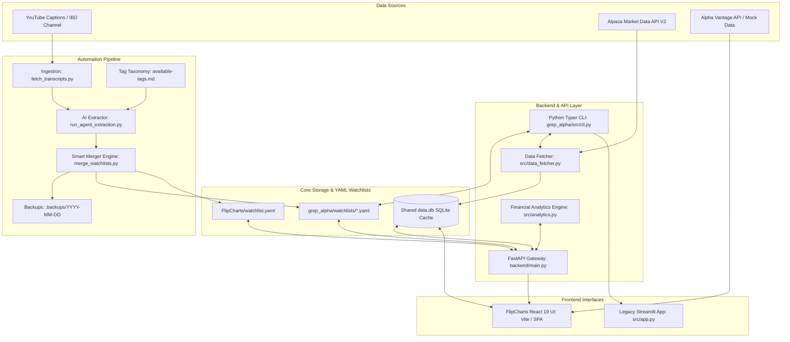
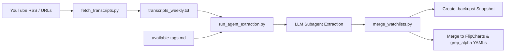

# 📈 Grep Alpha: Unified Watchlist Monitor, Charting & Update Pipeline

A high-performance, hybrid trading intelligence platform and automated pipeline designed for swing traders, momentum investors, and quantitative analysts. 

**Grep Alpha** combines terminal-speed CLI watchlist management, a fast Python backend with SQLite price caching, a modern **React 19 + TypeScript** charting interface (**FlipCharts**) powered by TradingView `lightweight-charts`, and an AI-driven automated update pipeline for digesting market commentary into structured YAML watchlists.

---

## 📑 Table of Contents

- [🌟 Features Summary](#-features-summary)
- [🏗️ System Architecture](#️-system-architecture)
- [📁 Project Directory Structure](#-project-directory-structure)
- [⚡ Quick Start & Setup](#-quick-start--setup)
  - [Prerequisites](#prerequisites)
  - [1. Environment Configuration](#1-environment-configuration)
  - [2. Local Python Backend & CLI Setup](#2-local-python-backend--cli-setup)
  - [3. Local Web App Setup (FlipCharts)](#3-local-web-app-setup-flipcharts)
- [💻 Web Application Guide (FlipCharts)](#-web-application-guide-flipcharts)
  - [Interactive Candlesticks & Technical Indicators](#interactive-candlesticks--technical-indicators)
  - [Tag-Based Watchlist Filtering](#tag-based-watchlist-filtering)
  - [Sector Momentum Dashboard](#sector-momentum-dashboard)
  - [Live Thesis Notes & Persistence](#live-thesis-notes--persistence)
  - [Data Caching & Fallback Strategy](#data-caching--fallback-strategy)
- [💻 Terminal CLI Guide (`grep_alpha`)](#-terminal-cli-guide-grep_alpha)
  - [Watchlist Commands](#watchlist-commands)
  - [Market Data Sync](#market-data-sync)
  - [Legacy Streamlit Review](#legacy-streamlit-review)
- [🤖 Automated Update Pipeline (`update_pipeline`)](#-automated-update-pipeline-update_pipeline)
  - [Pipeline Architecture & Specification](#pipeline-architecture--specification)
  - [Ingestion & AI Agent Note Extraction](#ingestion--ai-agent-note-extraction)
  - [Smart Merge Engine & Conflict Policy](#smart-merge-engine--conflict-policy)
  - [Taxonomy Tagging Rules](#taxonomy-tagging-rules)
- [🌐 REST API Reference (`backend/main.py`)](#-rest-api-reference-backendmainpy)
  - [Watchlist Endpoints](#watchlist-endpoints)
  - [Market Data & Analytics Endpoints](#market-data--analytics-endpoints)
  - [System & Data Sync Endpoints](#system--data-sync-endpoints)
- [🐳 Docker Deployment](#-docker-deployment)
- [🧪 Financial Engineering & Indicators](#-financial-engineering--indicators)
  - [Base 100 Sector Indices](#base-100-sector-indices)
  - [Technical Indicators Specification](#technical-indicators-specification)
- [🤝 Contributing & License](#-contributing--license)

---

## 🌟 Features Summary

- 🚀 **High-Performance Candlestick Charts**: Built with TradingView's `lightweight-charts` rendering 10 EMA, 50 SMA, 200 SMA, and 14 ATR.
- 📊 **Sector & Theme Momentum (Base 100)**: Calculate **Price-Weighted** and **Equal-Weighted** indices to evaluate relative sector strength over 3-month and 1-year windows.
- ⚡ **Shared SQLite Cache (`data.db`)**: Local daily price caching prevents redundant third-party API queries and enables instant chart rendering.
- 🏷️ **Tag Taxonomy Filtering**: Group stocks across customizable tags (e.g., `AI_Adjacent`, `Semi-Fabless`, `Defense_Tech`, `Space`).
- 📝 **Interactive Thesis Editor**: Manage investment theses, target entry prices, and statuses (`watching`, `core_holding`, `trimmed`) in real time.
- 🛠️ **Terminal-First CLI**: Manage YAML-based watchlists (`add`, `rm`, `note`, `ls`, `sync`) without leaving your shell environment.
- 🤖 **Automated AI Update Pipeline**: Scrape YouTube market video transcripts (e.g., Investor's Business Daily / Stock Market Today), extract ticker theses via LLM subagents, and merge them into watchlists while preserving manual user notes.
- 🐳 **Full Dockerization**: Run the unified FastAPI server and pre-compiled React SPA inside a multi-stage Docker container.

---

## 🏗️ System Architecture



---

## 📁 Project Directory Structure

```
grep_alpha/
├── Dockerfile                        # Multi-stage build (Node 22 builder + Python 3.11 FastAPI runner)
├── docker-compose.yml                # Docker compose orchestration (Ports 3000 -> 8000, volume mounts)
├── available-tags.md                 # Taxonomy of approved sector/industry tags for AI extraction
├── data.db                           # Shared SQLite database containing daily historical price tables
│
├── backend/                          # FastAPI Backend API Gateway
│   └── main.py                       # REST endpoints for watchlists, price indicators, sector momentum, & sync
│
├── FlipCharts/                       # React 19 + TypeScript Frontend Web Application
│   ├── index.html                    # Single Page Application HTML entry point
│   ├── package.json                  # NPM dependencies (lightweight-charts, lucide-react, motion, vite)
│   ├── vite.config.ts                # Vite dev server config with built-in node:sqlite DB middleware
│   ├── watchlist.yaml                # Watchlist YAML definition for FlipCharts
│   ├── src/
│   │   ├── components/               # React UI components (ChartCard, SectorMomentumChart, WatchlistStats, etc.)
│   │   ├── context/                  # ServiceContext managing watchlists and API clients
│   │   └── lib/
│   │       ├── api/                  # ApiClient, DatabaseApiClient, and Alpaca/AlphaVantage fallbacks
│   │       ├── charts/               # Lightweight-charts rendering logic & indicators
│   │       └── utils/                # YAML parsing and metadata utilities
│   └── dist/                         # Production static assets built by Vite
│
├── grep_alpha/                       # Core Python Module & CLI Environment
│   ├── config.yaml                   # Application configuration file
│   ├── requirements.txt              # Python dependencies (fastapi, pandas, pandas_ta, alpaca-py, typer, streamlit)
│   ├── watchlists/                   # Category watchlists stored in YAML format
│   │   ├── AI_related.yaml
│   │   ├── defense_tech.yaml
│   │   ├── IBD_weekly.yaml
│   │   ├── IDB_top_50.yaml
│   │   └── large_cap_bio.yaml
│   ├── src/
│   │   ├── cli.py                    # Typer CLI application (`watch add`, `watch rm`, `watch sync`, etc.)
│   │   ├── database.py               # SQLite schema initialization and row querying
│   │   ├── data_fetcher.py           # Alpaca API historical EOD data fetcher & delta synchronizer
│   │   ├── analytics.py              # Base 100 Price-Weighted & Equal-Weighted index math & ATR
│   │   ├── yaml_manager.py           # CRUD operations for watchlists directory
│   │   └── app.py                    # Legacy Streamlit visual dashboard
│   └── tests/                        # Comprehensive pytest test suite for analytics, DB, and API logic
│
└── update_pipeline/                  # Automated Watchlist Ingestion & AI Agent Pipeline
    ├── update_pipeline.md            # Phased roadmap and implementation blueprint
    └── watchlist_pipeline_spec.md    # Full technical specification for YouTube transcript extraction & merging
```

---

## ⚡ Quick Start & Setup

### Prerequisites

- **Python**: Version `3.10` or higher (`3.11+` recommended).
- **Node.js**: Version `22.5.0` or higher (required for native `node:sqlite` module support in Vite dev mode).
- **Alpaca Markets Account**: Free Paper Trading API credentials work seamlessly.

### 1. Environment Configuration

Create a `.env` file in the root directory (or export variables in your shell):

```bash
# Alpaca Market Data Credentials
export APCA_API_KEY_ID="your_alpaca_key_id"
export APCA_API_SECRET_KEY="your_alpaca_secret_key"
export APCA_API_BASE_URL="https://paper-api.alpaca.markets"

# Optional: External Fallback API Key
export VITE_ALPHA_VANTAGE_KEY="your_alpha_vantage_key"
```

### 2. Local Python Backend & CLI Setup

```bash
# Create and activate a Python virtual environment
python3 -m venv venv
source venv/bin/activate

# Install core dependencies
pip install -r grep_alpha/requirements.txt

# Add project root and grep_alpha to PYTHONPATH
export PYTHONPATH=$PYTHONPATH:$(pwd):$(pwd)/grep_alpha

# Initialize SQLite database schema
python -c "from grep_alpha.src import database; database.init_db()"

# Start the FastAPI Backend Server
python -m uvicorn backend.main:app --reload --port 8000
```
*The FastAPI interactive API documentation will be accessible at [http://localhost:8000/docs](http://localhost:8000/docs).*

### 3. Local Web App Setup (FlipCharts)

In a separate terminal window:

```bash
cd FlipCharts

# Install Node.js dependencies
npm install

# Start Vite development server
npm run dev
```
*Open [http://localhost:3000](http://localhost:3000) in your browser to view the FlipCharts UI.*

---

## 💻 Web Application Guide (FlipCharts)

**FlipCharts** is a high-performance web interface designed for fast visual analysis of watchlists.

```
+-----------------------------------------------------------------------------------+
|  [Logo] FlipCharts  | Search: [ AAPL  ] | Filter: [ All Tags v ] | Sync Status: 🟢 |
+-----------------------------------------------------------------------------------+
| SIDEBAR TAGS       | MAIN DASHBOARD                                               |
| - All (42)         | +----------------------------------------------------------+ |
| - AI_Adjacent (12) | | SECTOR MOMENTUM (Base 100)                               | |
| - Big_Tech (8)     | | --- Price-Weighted   --- Equal-Weighted                | |
| - Semi-Fabless (6) | +----------------------------------------------------------+ |
| - Defense_Tech (5) |                                                              |
|                    | +-----------------------------+ +--------------------------+ |
| TICKER WATCHLIST   | | NVDA ($124.50 +3.2%)        | | PLTR ($28.40 +1.8%)       | |
| - NVDA  (core)     | | [Candlestick Chart + EMAs]  | | [Candlestick Chart]      | |
| - PLTR  (watching) | | Thesis: AI GPU demand       | | Thesis: AIP expansion    | |
| - AMD   (watching) | +-----------------------------+ +--------------------------+ |
+--------------------+--------------------------------------------------------------+
```

### Interactive Candlesticks & Technical Indicators
- **High-Resolution Canvas**: Powered by `lightweight-charts`. Supports zooming, panning, and precise timestamp inspection.
- **Overlay Indicators**:
  - **10 EMA** (Exponential Moving Average, yellow line): Short-term momentum tracking.
  - **50 SMA** (Simple Moving Average, blue line): Intermediate institutional trend support.
  - **200 SMA** (Simple Moving Average, red line): Major long-term market trendline.
  - **14 ATR** (Average True Range): Displayed in chart statistics for position sizing and stop-loss calculation.
- **Timeframe Selector**: Toggle instantly between `1D`, `1W`, `3M`, `6M`, and `1Y` lookbacks.

### Tag-Based Watchlist Filtering
- Tickers are automatically categorized by tags loaded from `watchlist.yaml` or backend watchlists.
- Click any tag in the sidebar (e.g., `Defense_Tech`, `Semi-Fabless`) to narrow down displayed charts instantly.

### Sector Momentum Dashboard
- Visualizes combined performance for the selected group.
- Displays both **Price-Weighted** and **Equal-Weighted** Base 100 indices to differentiate single-stock mega-cap distortions from broad sector participation.

### Live Thesis Notes & Persistence
- Every chart card displays the associated thesis, status (`watching`, `core_holding`, `trimmed`), target entry price, and tags.
- Edit theses directly inside the UI; changes are saved via the backend API back to the underlying YAML files.

### Data Caching & Fallback Strategy
1. **Primary**: Queries the local `/api/prices` endpoint powered by SQLite (`data.db`).
2. **Secondary Fallback**: If data is missing or incomplete, transparently queries Alpaca Data V2 or Alpha Vantage.
3. **Mock Fallback**: Generates simulated geometric Brownian motion price series for offline testing if no API keys are provided.

---

## 💻 Terminal CLI Guide (`grep_alpha`)

The CLI interface (`grep_alpha/src/cli.py`) lets you manage watchlists and trigger market data ingestion directly from your shell.

```bash
# Run CLI commands using python
python grep_alpha/src/cli.py watch --help
```

### Watchlist Commands

- **List Watchlists**:
  ```bash
  python grep_alpha/src/cli.py watch ls
  ```
- **Add Ticker**:
  ```bash
  python grep_alpha/src/cli.py watch add AAPL tech --thesis "Breaking out of multi-month base"
  ```
- **Update Thesis Note**:
  ```bash
  python grep_alpha/src/cli.py watch note AAPL tech "Revised target: $230 post earnings"
  ```
- **Remove Ticker**:
  ```bash
  python grep_alpha/src/cli.py watch rm AAPL tech
  ```

### Market Data Sync

Perform incremental delta synchronization to pull missing daily OHLCV prices from Alpaca into `data.db`:

```bash
python grep_alpha/src/cli.py watch sync
```

### Legacy Streamlit Review

Launch the legacy Streamlit interactive dashboard for a specific watchlist category:

```bash
python grep_alpha/src/cli.py watch review defense_tech
```

---

## 🤖 Automated Update Pipeline (`update_pipeline`)

The **Update Pipeline** automates the ingestion of video transcripts (e.g., Investor's Business Daily / Stock Market Today YouTube channels) and converts video notes into structured watchlist additions.

### Pipeline Architecture & Specification



### Ingestion & AI Agent Note Extraction

1. **Transcript Fetching (`scripts/fetch_transcripts.py`)**:
   - Supports explicit video URLs (`--urls "https://youtube.com/watch?v=..."`) or automatic 7-day channel scans (`--auto-ibd`).
   - Aggregates video captions without downloading audio or video files.
2. **AI Extraction (`scripts/run_agent_extraction.py`)**:
   - Sends transcript text to an Antigravity AI Agent prompt.
   - Enforces strict JSON/YAML schema output.
   - Requires institutional-grade investment thesis verification before populating the thesis field.

### Smart Merge Engine & Conflict Policy

The merge module (`scripts/merge_watchlists.py`) guarantees zero clobbering of user customizations:

- 📸 **Automatic Backups**: Always copies existing YAML files to `.backups/YYYY-MM-DD_HHMMSS/` before modifying files.
- 🛡️ **Preserves User State**: If a ticker already exists in a watchlist, its user-defined `status` (e.g. `core_holding`), custom `target_entry`, and custom `thesis` are preserved.
- ➕ **Appends New Tickers**: New tickers are added with default `status: watching`.
- 🏷️ **Tag Union**: Merges new tags with existing tags without removing user tags.

### Taxonomy Tagging Rules

The AI Agent maps tags strictly against `available-tags.md`:

| Tag Category | Description / Scope |
| :--- | :--- |
| `AI_Adjacent` | Companies directly benefiting from AI infrastructure / workloads |
| `Big_Tech` | Mega-cap technology leaders |
| `Semi-Fabless` | Fabless semiconductor design companies |
| `Semi-IDM` | Integrated device manufacturers (semiconductors) |
| `Defense_Tech` | Military technology, defense systems, and aerospace |
| `sUAS_drones` | Small Unmanned Aerial Systems & drone makers |
| `Space` | Satellite, launch vehicles, and space tech |
| `Bio` / `Pharma` | Biotech and pharmaceutical innovators |
| `Power` | Energy generation, grid power, and nuclear systems for AI |

---

## 🌐 REST API Reference (`backend/main.py`)

The FastAPI server acts as a unified API gateway for both the web app and third-party integrations.

### Watchlist Endpoints

| Method | Endpoint | Description |
| :--- | :--- | :--- |
| `GET` | `/api/watchlists` | List all watchlist categories with symbol counts |
| `GET` | `/api/watchlists/{category}` | Retrieve full detail and ticker lists for a category |
| `POST` | `/api/watchlists/{category}/tickers` | Add a new ticker to a category |
| `PATCH` | `/api/watchlists/{category}/tickers/{symbol}` | Update thesis, status, target entry, or tags |
| `DELETE` | `/api/watchlists/{category}/tickers/{symbol}` | Remove a ticker from a category |

### Market Data & Analytics Endpoints

| Method | Endpoint | Query Parameters | Description |
| :--- | :--- | :--- | :--- |
| `GET` | `/api/prices` | `symbol` (str), `timeframe` (`1D`,`1W`,`3M`,`6M`,`1Y`) | Daily OHLCV data + 10 EMA, 50 SMA, 200 SMA, 14 ATR |
| `GET` | `/api/analytics/sector-momentum` | `category` (str), `timeframe` (`3m`,`1y`) | Price-Weighted & Equal-Weighted Base 100 series |

### System & Data Sync Endpoints

| Method | Endpoint | Description |
| :--- | :--- | :--- |
| `POST` | `/api/sync` | Trigger async background market data sync task |
| `GET` | `/api/status` | Get DB row counts, latest cached date, and background sync state |

---

## 🐳 Docker Deployment

Run the entire application stack in a single production container using Docker & Docker Compose.

### Build and Run with Docker Compose

```bash
# Set your Alpaca environment variables
export APCA_API_KEY_ID="your_key_id"
export APCA_API_SECRET_KEY="your_secret_key"

# Build image and start service in detached mode
docker compose up -d --build
```

Access the unified application at **[http://localhost:3000](http://localhost:3000)**.

### Trigger Sync inside Container

```bash
docker compose exec app python grep_alpha/src/cli.py watch sync
```

---

## 🧪 Financial Engineering & Indicators

### Base 100 Sector Indices

To prevent high-priced stocks from distorting group trends, Grep Alpha calculates two distinct index methodologies normalized to $100.00$ at the start date ($t_0$):

1. **Price-Weighted Index ($I_{PW}$)**:
   $$I_{PW}(t) = 100 \times \frac{\sum_{i=1}^{N} P_i(t)}{\sum_{i=1}^{N} P_i(t_0)}$$
2. **Equal-Weighted Index ($I_{EW}$)**:
   $$I_{EW}(t) = \frac{100}{N} \sum_{i=1}^{N} \frac{P_i(t)}{P_i(t_0)}$$

### Technical Indicators Specification

- **Exponential Moving Average (EMA 10)**:
  $$\text{EMA}_t = P_t \times \left(\frac{2}{10+1}\right) + \text{EMA}_{t-1} \times \left(1 - \frac{2}{10+1}\right)$$
- **Simple Moving Average (SMA $k$)**:
  $$\text{SMA}_k(t) = \frac{1}{k} \sum_{j=0}^{k-1} P_{t-j} \quad (k \in \{50, 200\})$$
- **Average True Range (ATR 14)**:
  $$\text{TR}_t = \max(H_t - L_t, |H_t - C_{t-1}|, |L_t - C_{t-1}|)$$
  $$\text{ATR}_{14}(t) = \frac{\text{ATR}_{14}(t-1) \times 13 + \text{TR}_t}{14}$$

---

## 🤝 Contributing & License

Contributions are welcome! Please follow these guidelines:
1. Ensure all new features include corresponding `pytest` tests in `grep_alpha/tests/`.
2. Format code according to standard PEP 8 rules for Python and ESLint/Prettier for TypeScript.
3. Open a pull request or issue describing proposed changes.

*License: MIT*
