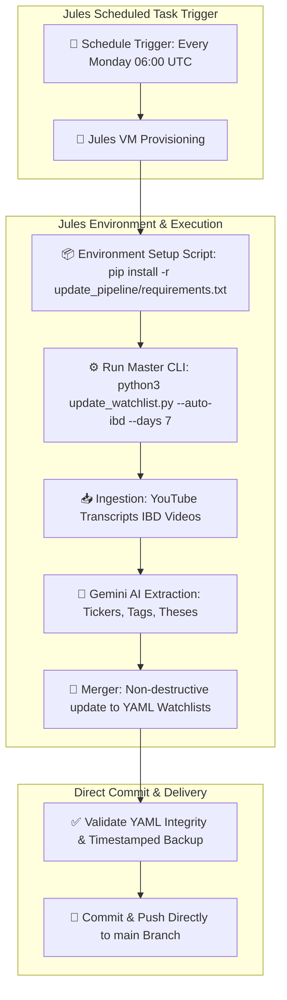

# Implementation Plan: Automating Weekly Data Updates with Jules Scheduled Tasks

This document provides a technical strategy and actionable implementation plan to leverage **Jules Scheduled Tasks** to automatically run the watchlist data update pipeline every Monday morning, keeping the stock watchlist and investment theses fresh without manual execution.

---

## 🎯 Feasibility & Architecture Overview

### Is this possible with Jules Scheduled Tasks?
**Yes, absolutely.** Jules features a dedicated **Scheduled Tasks** mode designed specifically for routine repository maintenance, data ingestion, and recurring automated workflows. 

When scheduled, Jules:
1. Provisions a clean, short-lived virtual machine (VM) on the configured schedule (e.g., every Monday at 06:00 AM UTC).
2. Clones the repository and runs your environment setup script (installing Python dependencies).
3. Executes the update pipeline (`python3 update_watchlist.py --auto-ibd`).
4. Performs AI extraction via Gemini, parses YouTube transcripts, and updates `FlipCharts/watchlist.yaml` & `grep_alpha/watchlists/IDB_top_50.yaml`.
5. Commits and pushes the updated watchlists directly to `main`, ensuring fresh data is ready at the start of each week.



---

## ✅ Success Criteria

The automated weekly data update task is considered successful when all of the following conditions are satisfied:

1. **Automated Trigger**: Jules executes the task on schedule every Monday at 06:00 AM UTC without human intervention.
2. **Transcript Ingestion**: The ingestion module fetches all IBD *Stock Market Today* video transcripts published in the preceding 7 days.
3. **AI Extraction Quality**: Ticker symbols, descriptive sector tags (validated against `available-tags.md`), and institutional investment theses are correctly parsed via Gemini AI.
4. **Non-Destructive State Preservation**: User-configured fields (`status`, `target_entry`, custom notes) in existing watchlist files are preserved 100%.
5. **Backup Verification**: A timestamped backup folder is automatically written under `.backups/YYYY-MM-DD_HHMMSS/`.
6. **Direct Branch Delivery**: The updated `FlipCharts/watchlist.yaml` and `grep_alpha/watchlists/IDB_top_50.yaml` files are committed and pushed directly to `main` with commit message `[Automated] Weekly Watchlist Refresh - YYYY-MM-DD`.

---

## 🛠️ Proposed Repository Changes

To ensure Jules can execute this pipeline reproducibly, we will add dependency files and repo guidelines.

### Component 1: Dependency Management

#### [NEW] `update_pipeline/requirements.txt`
Explicit dependencies required for YouTube transcript scraping, YAML handling, and Gemini HTTP calls.

```text
youtube-transcript-api>=0.6.0
pyyaml>=6.0
requests>=2.31.0
yt-dlp>=2024.0.0
```

---

### Component 2: Repository Agent Instructions

#### [NEW] `AGENTS.md`
Repo instructions so Jules and AI agents understand how to set up the environment, run the pipeline, and verify outputs.

```markdown
# Jules Agent Guidelines for Watchlist Automation

## Environment Setup Script
```bash
pip install -r update_pipeline/requirements.txt
```

## Running Weekly Watchlist Update Pipeline
```bash
python3 update_watchlist.py --auto-ibd --days 7
```

## Verification & Checks
1. Validate python scripts return exit code 0.
2. Confirm `.backups/` directory contains a timestamped backup of watchlists.
3. Check `FlipCharts/watchlist.yaml` and `grep_alpha/watchlists/IDB_top_50.yaml` for valid YAML syntax.

---

## 📋 Jules Configuration Walkthrough

Below are the exact configuration details to set up in the Jules web interface:

### 1. Environment Variables Configuration (Jules UI)
In Jules Dashboard -> **grep_alpha** repo -> **Settings / Environment Variables**:
- `GEMINI_API_KEY`: Set your Google Gemini API key secret.

---

### 2. Environment Setup Script (Jules UI)
In Jules Dashboard -> **grep_alpha** repo -> **Configuration** -> **Initial Setup Script**:

```bash
# Environment Setup Script for Jules VM
echo "Setting up Python environment for Watchlist Automation..."
pip install -r update_pipeline/requirements.txt

# Run pre-flight verification
python3 update_pipeline/scripts/fetch_transcripts.py --test
echo "Environment setup complete."
```
*Click **Run and Snapshot** to freeze the environment VM snapshot.*

---

### 3. Scheduled Action Task Prompt (Jules UI)
In the Jules **Task Input** field, paste the following prompt:

```text
Run the weekly watchlist automation pipeline to ingest the past week's Investor's Business Daily (IBD) Stock Market Today transcripts, extract stock tickers and investment theses via Gemini, and non-destructively merge the results into the repository watchlists.

Please execute the following steps precisely:
1. Run the master update pipeline CLI:
   python3 update_watchlist.py --auto-ibd --days 7

2. Verify output integrity:
   - Ensure the exit code is 0.
   - Confirm a new timestamped backup directory was created in .backups/
   - Confirm updated ticker data was written to FlipCharts/watchlist.yaml and grep_alpha/watchlists/IDB_top_50.yaml.
   - Verify both YAML files are valid and parseable without syntax errors.

3. Commit and Push Changes:
   - Stage the updated watchlist files and the timestamped backup.
   - Commit directly to main with the commit message:
     "[Automated] Weekly Watchlist Refresh - YYYY-MM-DD"
   - Push the commit directly to the main branch.
```

#### Task Schedule Settings:
- **Planning Mode**: Select **Scheduled Task**
- **Frequency**: **Weekly**
- **Day**: **Monday**
- **Time**: **06:00 AM UTC** (02:00 AM EST)
- **Delivery Mode**: **Direct Push to Main**

---

## 🧪 Verification Plan

### Local Pre-flight Verification
```bash
# 1. Test pipeline end-to-end in dry-run mode
python3 update_watchlist.py --auto-ibd --dry-run

# 2. Test individual script self-tests
python3 update_pipeline/scripts/fetch_transcripts.py --test
python3 update_pipeline/scripts/merge_watchlists.py --test-merge
```

### Scheduled Task Verification in Jules
1. In the Jules Scheduled Tasks tab, click **Run Now** to execute a manual trigger test.
2. Confirm Jules successfully runs the setup script, executes `update_watchlist.py`, updates `FlipCharts/watchlist.yaml` & `grep_alpha/watchlists/IDB_top_50.yaml`, and pushes directly to `main`.
