# Watchlist Automation Pipeline

This directory contains the standalone **Watchlist Automation Pipeline**, a tool designed to automatically ingest weekly YouTube video notes from Investor's Business Daily (IBD) / Stock Market Today, extract stock ticker symbols with institutional-grade investment theses and sector tags using Gemini AI, and safely merge the updated data into your application watchlists.

---

## 🎯 System Architecture

```mermaid
flowchart TD
    A[Master CLI: update_watchlist.py] --> B[Ingestion: scripts/fetch_transcripts.py]
    B -->|3-Tier Fallback| C[YouTube Captions / yt-dlp / Page Scraper]
    C -->|Aggregated Transcripts| D[Scratch Buffer: scratch/transcripts_weekly.txt]
    D --> E[Extraction: scripts/run_agent_extraction.py]
    E -->|Reads Taxonomy| F[available-tags.md]
    E -->|Structured Gemini Prompt| G[Gemini API / Antigravity Agent]
    G -->|JSON Payload| H[Scratch YAML: scratch/extracted_tickers.yaml]
    H --> I[Merger Engine: scripts/merge_watchlists.py]
    I -->|Timestamped Backup| J[Backups: .backups/YYYY-MM-DD_HHMMSS/]
    I -->|Preserve User State| K[FlipCharts Watchlist: FlipCharts/watchlist.yaml]
    I -->|Update Top 50| L[grep_alpha Watchlist: grep_alpha/watchlists/IDB_top_50.yaml]
```



---

## 📋 Features & Design Principles

* **Single-Command Workflow:** Replaces manual video watching, NotebookLM note taking, CSV exporting, and manual YAML editing with one execution.
* **3-Tier Transcript Ingestion:**
  1. **Tier 1 (Primary): `youtube-transcript-api`** (lightweight, keyless web player caption extractor).
  2. **Tier 2 (Secondary): `yt-dlp` subtitle downloader** (handles YouTube web player updates).
  3. **Tier 3 (Channel Scraper): Web page video ID scraper** (handles RSS rate limits or 404s).
* **AI Extraction & Tag Mapping:** Uses Gemini 2.5 Flash / Antigravity Agent to extract tickers, assign at least 2 relevant sector tags cross-referenced against `available-tags.md`, and formulate data-driven theses.
* **Smart Non-Destructive Merging:**
  - Creates automatic timestamped backups before making changes.
  - Preserves user-assigned ticker `status` (e.g. `core_holding`, `watching`).
  - Preserves user-customized `target_entry` price points.
  - Retains existing custom theses while appending new tags.

---

## 🚀 Quick Start & Usage

### 1. Prerequisites
Ensure Python 3.10+ is installed and dependencies are satisfied:
```bash
pip install youtube-transcript-api pyyaml requests
```
Set your Gemini API Key in the environment (if running outside an active Antigravity session):
```bash
export GEMINI_API_KEY="your-api-key-here"
```

### 2. Basic Commands

#### Option A: Auto-fetch past week's Stock Market Today videos from IBD
```bash
python3 update_watchlist.py --auto-ibd
```

#### Option B: Process specific YouTube video URLs or IDs
```bash
python3 update_watchlist.py --urls "https://www.youtube.com/watch?v=VIDEO1,https://www.youtube.com/watch?v=VIDEO2"
```

#### Option C: Custom lookback window (e.g., last 14 days)
```bash
python3 update_watchlist.py --auto-ibd --days 14
```

#### Option D: Dry-run test (simulates end-to-end execution without modifying watchlists)
```bash
python3 update_watchlist.py --auto-ibd --dry-run
```

---

## 📂 Directory Structure

```
update_pipeline/
├── README.md                     # Pipeline documentation (this file)
├── watchlist_pipeline_spec.md    # Full technical & architectural specification
├── update_pipeline.md            # Phased implementation plan & testing roadmap
├── update_watchlist.py           # Master CLI entry point
├── scripts/
│   ├── fetch_transcripts.py      # Ingestion & transcript scraper module
│   ├── run_agent_extraction.py   # Gemini AI extraction module
│   └── merge_watchlists.py       # Smart merger & backup engine
├── scratch/                      # Temporary transcript & extracted data buffer
│   ├── transcripts_weekly.txt
│   └── extracted_tickers.yaml
└── .backups/                     # Timestamped backups created prior to merges
```

---

## 🧪 Testing & Self-Verification

Each script includes built-in self-tests and dry-run validation flags:

```bash
# 1. Test Ingestion script URL parsing:
python3 scripts/fetch_transcripts.py --test

# 2. Test Extraction agent in dry-run mode:
python3 scripts/run_agent_extraction.py --dry-run

# 3. Test Merger logic:
python3 scripts/merge_watchlists.py --test-merge

# 4. Run Full End-to-End Dry-Run Test:
python3 update_watchlist.py --auto-ibd --dry-run
```
