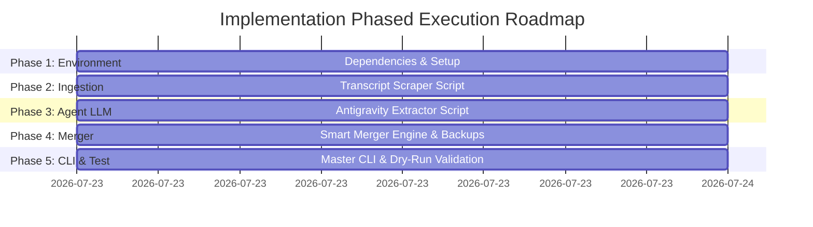

# Phased Implementation Plan: Watchlist Automation Pipeline

This document details the step-by-step implementation plan for executing the [System Specification](file:///home/guid/projects/watchlist_monitor/update_pipeline/watchlist_pipeline_spec.md).

---

## 📅 Roadmap Overview



---

## 🛠️ Detailed Phase Breakdown

### Phase 1: Python Environment & Dependencies Setup
* **Objective:** Prepare virtual environment and verify all required python packages.
* **Tasks:**
  - Create virtual environment `venv` if missing.
  - Install dependencies: `youtube-transcript-api`, `pyyaml`, `requests`.
  - Create directory structure for scripts (`scripts/`) and scratch/backups (`scratch/`, `.backups/`).
* **Verification Command:**
  ```bash
  python3 -c "import youtube_transcript_api, yaml, requests; print('Phase 1 dependencies verified')"
  ```

---

### Phase 2: Ingestion & Transcript Extraction Module
* **Objective:** Implement `scripts/fetch_transcripts.py` to retrieve captions from YouTube URLs or IBD RSS channel feeds.
* **Tasks:**
  - Parse YouTube video IDs from URLs (`watch?v=...`, `youtu.be/...`).
  - Implement IBD channel RSS feed parser (`https://www.youtube.com/feeds/videos.xml?user=investorsbusinessdaily` or `channel_id=UC...`) to filter videos from the last 7 days.
  - Extract transcript segments and aggregate text formatted by video.
* **Verification Command:**
  ```bash
  python3 scripts/fetch_transcripts.py --url "https://www.youtube.com/watch?v=dQw4w9WgXcQ" --test
  ```

---

### Phase 3: Antigravity Subagent Orchestration Module
* **Objective:** Implement `scripts/run_agent_extraction.py` to process aggregated transcript text into structured JSON/YAML ticker data.
* **Tasks:**
  - Load tag taxonomy from [available-tags.md](file:///home/guid/projects/watchlist_monitor/available-tags.md).
  - Construct prompt enforcing ticker extraction, thesis criteria, and minimum 2 tag mappings.
  - Connect with Antigravity subagent runtime / CLI.
  - Add schema validator to ensure returned JSON/YAML strictly adheres to ticker schema.
* **Verification Command:**
  ```bash
  python3 scripts/run_agent_extraction.py --input "scratch/transcripts_test.txt" --dry-run
  ```

---

### Phase 4: Smart Merger & Backup Engine
* **Objective:** Implement `scripts/merge_watchlists.py` to update watchlists safely.
* **Tasks:**
  - Build automatic backup handler saving existing files to `.backups/YYYY-MM-DD_HHMMSS/`.
  - Implement deep merge logic for [FlipCharts/watchlist.yaml](file:///home/guid/projects/watchlist_monitor/FlipCharts/watchlist.yaml):
    * Preserve existing ticker `status` (e.g. `core_holding`), custom `target_entry`, and custom `thesis`.
  - Implement merge logic for [grep_alpha/watchlists/IDB_top_50.yaml](file:///home/guid/projects/watchlist_monitor/grep_alpha/watchlists/IDB_top_50.yaml).
  - Update top-level `updated: "YYYY-MM-DD"` date stamp.
* **Verification Command:**
  ```bash
  python3 scripts/merge_watchlists.py --test-merge
  ```

---

### Phase 5: Master CLI Entry Point & End-to-End Testing
* **Objective:** Implement `./update_watchlist.py` CLI runner tying all phases together into a single command.
* **Tasks:**
  - Build CLI wrapper using `argparse` or `typer` supporting `--urls`, `--auto-ibd`, and `--dry-run`.
  - Implement full pipeline execution flow: `Fetch -> Extract -> Merge -> Backup`.
  - Perform end-to-end dry-run test with sample video inputs.
* **Verification Command:**
  ```bash
  ./update_watchlist.py --auto-ibd --dry-run
  ```

---

## 🧪 Testing Strategy

To ensure reliability, the pipeline will include both Unit Tests and Integration Tests, executed via `pytest`.

### 1. Unit Tests
* **`test_fetch_transcripts.py`**:
  - Test URL parsing regex to ensure video IDs are correctly extracted.
  - Mock YouTube transcript API responses to verify text aggregation and formatting.
  - Test RSS feed parsing for the `--auto-ibd` flag.
* **`test_run_agent_extraction.py`**:
  - Mock agent LLM responses with predefined transcripts.
  - Verify the schema validation ensures `status`, `target_entry`, `tags`, and `thesis` keys exist.
  - Test the handling of malformed LLM outputs (e.g., missing keys or broken YAML).
* **`test_merge_watchlists.py`**:
  - Test that existing `status` and `target_entry` values are preserved when merging a ticker.
  - Test that new tickers are appended with default values.
  - Verify that the backup mechanism correctly copies files to `.backups/` before any writes occur.

### 2. Integration Tests
* **End-to-End Dry Run (`test_pipeline_e2e.py`)**:
  - Run the `update_watchlist.py` master script with the `--dry-run` flag using a static, mock transcript file.
  - Verify the entire flow executes without errors: Ingestion -> Extraction -> Merge.
  - Assert that the final state of the mock watchlists matches the expected outcome without actually modifying the live `FlipCharts` or `grep_alpha` directories.

---

## ✅ Definition of Done (DoD)

For each phase to be considered complete, the following conditions must be met:
1. **Code Complete:** The script/module is fully implemented according to the spec, free of syntax errors, and thoroughly documented.
2. **Tested:** The verification command for the phase passes without errors or exceptions.
3. **Integrated:** The module successfully passes data to (or accepts data from) the adjacent phases without requiring manual intervention.
4. **Resilient:** Edge cases (e.g., unavailable transcripts, network timeouts, unparseable LLM output) are handled gracefully with clear logging.

---

## 🏆 Success Criteria

The overall pipeline creation project will be deemed successful when:
1. **Single-Command Execution:** The entire workflow (Ingestion → Extraction → Merge) can be triggered via a single command (e.g., `./update_watchlist.py --auto-ibd`).
2. **Zero Manual Copy-Pasting:** The user no longer needs to use NotebookLM, manually copy CSVs, or hand-edit YAML files (except for making manual override adjustments post-run).
3. **Data Integrity Maintained:** The `merge_watchlists.py` script demonstrably preserves pre-existing user configurations (`status`, `target_entry`, custom `thesis`) across multiple test runs without clobbering data.
4. **Accurate Tagging & Theses:** The Antigravity Agent reliably assigns at least 2 valid tags from `available-tags.md` and only provides a thesis when strict institutional-grade criteria are met.
