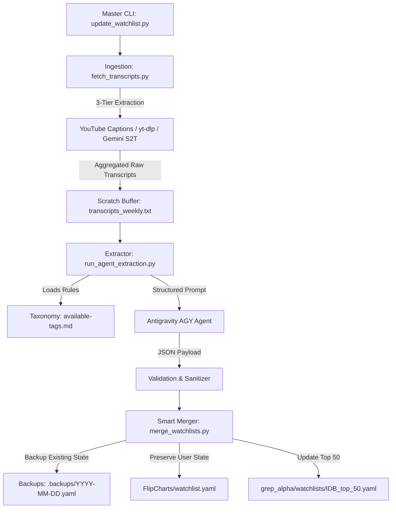

# System Specification: Unified Watchlist Automation Pipeline

## 1. Executive Summary & Goals
The goal of this system is to replace a manual 4-step workflow (watching weekly YouTube videos, extracting notes with NotebookLM, exporting to CSV, and running manual LLM prompts to update YAML watchlists) with a fully automated, unified single-command pipeline.

The pipeline will automatically:
1. Retrieve YouTube video transcripts from Investor's Business Daily / Stock Market Today channel for a given week or set of URLs.
2. Process video transcripts using an Antigravity Agent with strict prompt constraints, extracting ticker symbols, investment theses, and industry tags mapped against [available-tags.md](file:///home/guid/projects/watchlist_monitor/available-tags.md).
3. Safely merge extracted ticker data into the two target application watchlist stores ([FlipCharts/watchlist.yaml](file:///home/guid/projects/watchlist_monitor/FlipCharts/watchlist.yaml) and [grep_alpha/watchlists/IDB_top_50.yaml](file:///home/guid/projects/watchlist_monitor/grep_alpha/watchlists/IDB_top_50.yaml)) without clobbering existing statuses (`core_holding`, `watching`), target entry prices, or manually written theses.

---

## 2. Prerequisites & Environment Requirements

### 2.1 Runtime & Dependencies
* **Python 3.10+** (Python 3.14 present).
* **Python Libraries:**
  - `youtube-transcript-api` (pulls transcript text without downloading audio/video)
  - `pyyaml` (YAML parsing and formatting)
  - `requests` (parsing YouTube channel RSS feeds)

### 2.2 Credentials & API Keys
* **Antigravity CLI / Subagent Access:** Uses native Antigravity agent execution. No external API keys are strictly required for standard runs.
* *(Optional)* **Gemini API Key (`GEMINI_API_KEY`):** Supported fallback if executed as a standalone script outside Antigravity.
* *(Clarification)* **YouTube Data API Key (`YOUTUBE_API_KEY`):** Not required for downloading transcripts. YouTube Data API v3's `captions.download` endpoint requires OAuth2 channel owner authentication and returns `403 Forbidden` for third-party videos. The pipeline uses public caption scraping endpoints (and RSS feeds for channel scans), making an API key unnecessary.

---

## 3. System Architecture & Component Interaction



---

## 4. Module Specifications

### 4.1 Ingestion Module (`scripts/fetch_transcripts.py`)
* **Input Modes:**
  - Explicit URLs: `--urls "https://www.youtube.com/watch?v=..."`
  - Automatic Weekly Scan: `--auto-ibd` (fetches videos uploaded in the past 7 days from the IBD channel via RSS feed `https://www.youtube.com/feeds/videos.xml?channel_id=...`).
* **3-Tier Transcript Fallback Architecture:**
  1. **Tier 1 (Primary): `youtube-transcript-api`**  
     Scrapes public `timedtext` caption endpoints directly embedded in YouTube player responses without needing API keys or authentication.
  2. **Tier 2 (Secondary Scraper): `yt-dlp --write-auto-sub`**  
     Used if YouTube updates its player web layout or applies bot detection to direct web scraper requests.
  3. **Tier 3 (Tertiary Fallback / No Captions): Audio Download + Gemini Multimodal Speech-to-Text**  
     Downloads the audio stream (`yt-dlp -f ba`) and passes the audio directly into Gemini / Antigravity Agent native audio understanding for direct transcription and ticker extraction.
* **Processing:**
  - Extracts transcript chunks per video ID across available tiers.
  - Combines text into a formatted block with video metadata (Title, Date, Video ID).
* **Output:** Saves to `scratch/transcripts_weekly.txt`.

### 4.2 Extractor Module (`scripts/run_agent_extraction.py`)
* **Prompt Specification:**
  - System prompt enforces strict YAML/JSON return structure.
  - Formulates thesis **only** if institutional-grade thesis criteria are met in transcript context or verified knowledge; defaults to `""` otherwise.
  - Assigns minimum 2 tags per ticker cross-referenced against [available-tags.md](file:///home/guid/projects/grep_alpha/available-tags.md).
* **Schema Definition:**
  ```yaml
  name: "ibd top 50"
  updated: "YYYY-MM-DD"
  tickers:
    - symbol: "TICKER"
      status: "watching"
      target_entry: null
      tags: "Tag1, Tag2"
      thesis: "Investment thesis or empty string"
  ```

### 4.3 Smart Merge Engine (`scripts/merge_watchlists.py`)
* **Conflict & Merge Policy:**
  1. **Backup Generation:** Always copy existing target YAML files to `.backups/YYYY-MM-DD_HHMMSS/` prior to modification.
  2. **Existing Tickers:**
     - Retain `status` (e.g. `core_holding`), custom `target_entry` prices, and non-empty custom `thesis`.
     - Update or merge missing `tags`.
  3. **New Tickers:**
     - Append entry with default `status: watching` and `target_entry: null`.
  4. **Date Stamp:** Update top-level `updated:` field with current date (`YYYY-MM-DD`).

### 4.4 Target Application Integrations
* **grep_alpha Watchlist Format:**
  - Target Path: [grep_alpha/watchlists/IDB_top_50.yaml](file:///home/guid/projects/grep_alpha/watchlists/IDB_top_50.yaml)
  - Layout: Object with `name`, `updated`, and list of `tickers`.
* **FlipCharts Watchlist Format:**
  - Target Path: [FlipCharts/watchlist.yaml](file:///home/guid/projects/grep_alpha/FlipCharts/watchlist.yaml)
  - Layout: Direct list of ticker objects.

---

## 5. Master CLI Interface (`update_watchlist.py`)

### Command Usage Options
```bash
# Process specific YouTube video URLs
./update_watchlist.py --urls "https://www.youtube.com/watch?v=VIDEO1,https://www.youtube.com/watch?v=VIDEO2"

# Automatically find & process all IBD Stock Market Today videos from the last 7 days
./update_watchlist.py --auto-ibd

# Perform a dry-run test without writing changes to watchlists
./update_watchlist.py --auto-ibd --dry-run
```
